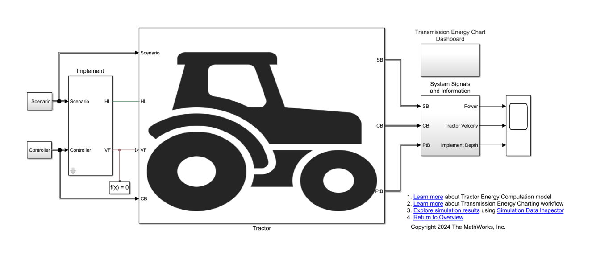
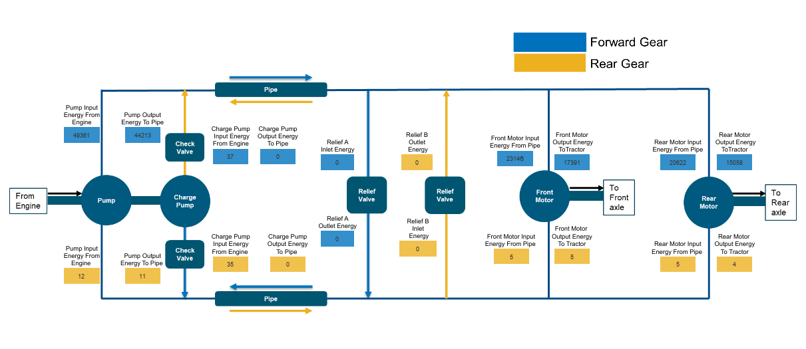
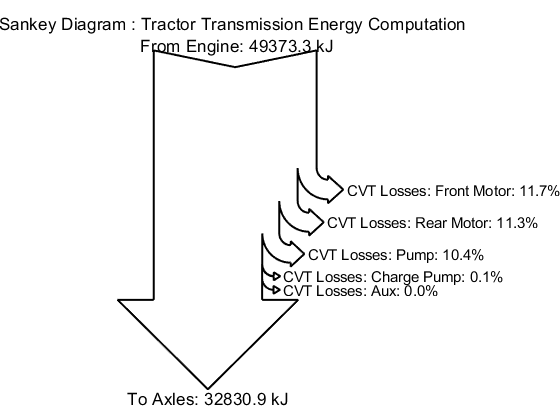

# Tractor Model with Simscape

This project contains custom libraries, models, and code to help you model 
a tractor. You can evaluate transmission losses and visualize energy charts 
for a tractor.
Tractor design is an important way to boost efficiency in agriculture. 
Developing a tractor model that interacts with the environment requires an 
accurate model of tire-soil dynamics that includes interaction of tractive 
elements such as tire and implement with soil, which is a complicated 
problem to solve. You can accelerate the development process by starting 
with a system-level analysis to evaluate the options. This project shows how to create a 
system-level tractor model using Simscape&trade;, Simscape Driveline&trade; 
and, Simscape Fluids&trade;.

This project contains a simplified system-level tractor model for tillage 
operation. You can define your own custom scenario and driver controls to 
analyze the tractor performance.

The project shows how to:
1. Parameterize components using custom library blocks such as the Tire 
(Tire-Soil Interaction) and Implement blocks. 

2. Build a Tractor Energy Computation Model from custom components and 
Simscape and Simscape Driveline blocks.

3. Perform Transmission Energy Charting and visualize the energy flow from 
the engine to the wheels.

## Setup 
* Clone the project repository.
* Open TractorModelSimscape.prj to get started with the project. 
* Requires MATLAB&reg; release R2024a or newer.

Copyright 2024 The MathWorks, Inc.
